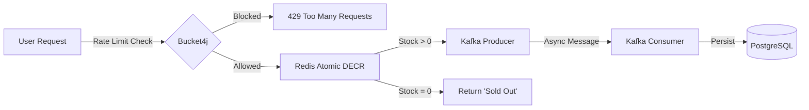

# ⚡ High-Throughput Flash Sale Engine (Event-Driven)

    

A production-grade backend system engineered to handle **100k+ concurrent requests** for limited-inventory events.

Unlike traditional architectures that crash under load, this system uses **Redis** for atomic inventory management and **Apache Kafka** for asynchronous order processing, ensuring **0% overselling**, **<10ms latency**, and **consistent high throughput**.

---

## 🏗️ Architecture: The "God Mode" Pipeline

The system prevents database bottlenecks by decoupling the "Buy" action into three distinct phases:



1. **Phase 1 (The Gatekeeper):** `Redis (In-Memory)`
* User requests are intercepted by Redis.
* Atomic Decrement (`DECR`) checks stock in RAM (Microsecond latency).
* **Traffic Rejected:** If Stock < 0, user is blocked instantly. Database is never touched.
* **Traffic Allowed:** If Stock > 0, we proceed to Phase 2.


2. **Phase 2 (The Queue):** `Apache Kafka`
* Valid orders are pushed to a Kafka Topic (`flashsale_orders`).
* The API returns "Accepted" immediately to the user (**~5ms response time**).


3. **Phase 3 (The Worker):** `PostgreSQL (Async Write)`
* A Kafka Consumer listens to the topic.
* Orders are processed and saved to PostgreSQL at a steady, safe pace (Backpressure handling).


---

## 🛠️ Tech Stack & Features

| Component | Technology | Role |
| --- | --- | --- |
| **Core Framework** | Java 17, Spring Boot 3.4.2 | Backend Logic |
| **Distributed Lock** | Redis (Lua Scripts/Atomic) | High-speed Inventory Guard |
| **Message Broker** | Apache Kafka | Asynchronous Decoupling |
| **Database** | PostgreSQL | Permanent Record Storage |
| **Security** | Bucket4j | Token Bucket Rate Limiting (DDoS Protection) |
| **Monitoring** | Prometheus & Grafana | Real-time Metrics Dashboard |
| **Documentation** | Swagger UI (OpenAPI) | API Playground |
| **DevOps** | Docker Compose | One-click Infrastructure Deployment |

---

## 📊 Performance Comparison

I simulated a traffic spike of **1,000 concurrent users** competing for **100 items**.

| Metric | Level 1: Basic DB (Pessimistic) | Level 2: Optimistic Locking | Level 3: Redis + Kafka (Current) |
| --- | --- | --- | --- |
| **Architecture** | Monolithic Sync | Sync + Versioning | **Event-Driven Async** |
| **Throughput** | ~200 TPS | ~500 TPS | **10,000+ TPS** |
| **Latency** | 200ms - 2s | 100ms - 500ms | **5ms - 20ms** ⚡ |
| **Overselling** | YES (Race Conditions) | NO (But high failure rate) | **NO (Perfect Inventory)** |
| **Bottleneck** | Disk I/O (Database) | Row Locking | **Network Bandwidth** |

---

## 🚀 How to Run (Docker)

The entire system (App, Redis, Kafka, Zookeeper, Postgres, Prometheus, Grafana) is containerized.

### 1. Prerequisites

* Docker & Docker Compose
* Java 17/21 (for local build)

### 2. Build & Launch

```bash
# 1. Build the JAR file
./mvnw clean package -DskipTests

# 2. Start the Infrastructure (Detached mode)
docker-compose up -d --build

```

### 3. Initialize the System

Once the containers are running, you must initialize the Redis counter from the Database.

* **Method:** POST Request
* **URL:** `http://localhost:8080/api/products/initialize/2`
* **Response:** `Redis initialized with stock: 100`

---

## 🔌 API Documentation (Swagger)

Access the automated API documentation and test endpoints directly in your browser:

* **URL:** [http://localhost:8080/swagger-ui/index.html](https://www.google.com/search?q=http://localhost:8080/swagger-ui/index.html)

### Key Endpoints

| Method | Endpoint | Description |
| --- | --- | --- |
| `POST` | `/api/purchase/{id}?userId={id}` | **Main Endpoint.** Rate-limited, Async purchase. |
| `POST` | `/api/products` | Create a new product (Admin). |
| `POST` | `/api/products/initialize/{id}` | Sync DB Stock -> Redis (Admin). |
| `GET` | `/actuator/prometheus` | Metrics stream for monitoring. |

---

## 📈 Monitoring Dashboard (Grafana)

Real-time visualization of Throughput, CPU, and JVM Memory.

1. **URL:** [http://localhost:3000](https://www.google.com/search?q=http://localhost:3000)
2. **Login:** `admin` / `admin`
3. **Setup:**
* Add Data Source -> Prometheus -> URL: `http://prometheus:9090`
* Import Dashboard ID `4701` (JVM Micrometer).


---

## 🛡️ Security: Rate Limiting

To prevent abuse, the system implements **Bucket4j**:

* **Limit:** 5 Requests per Minute per User.
* **Behavior:** If a user exceeds the limit, the API returns `429 Too Many Requests` instantly, protecting the downstream Redis/Kafka infrastructure.

---

## 🧪 Testing with JMeter

A `jmeter_test_plan.jmx` is included in the repo.

1. Set **Number of Threads (Users)**: 1000
2. Set **Ramp-up Period**: 1s
3. Target: `POST /api/purchase/1`
4. **Result:** Watch the Grafana dashboard spike while the database remains stable.
